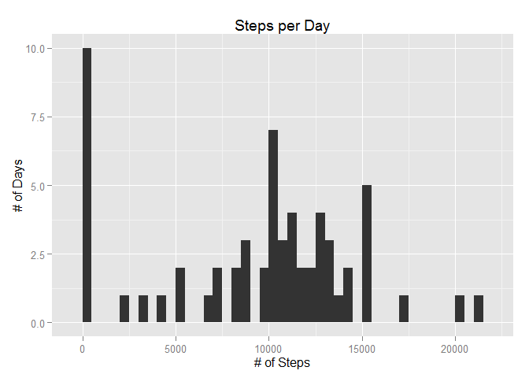
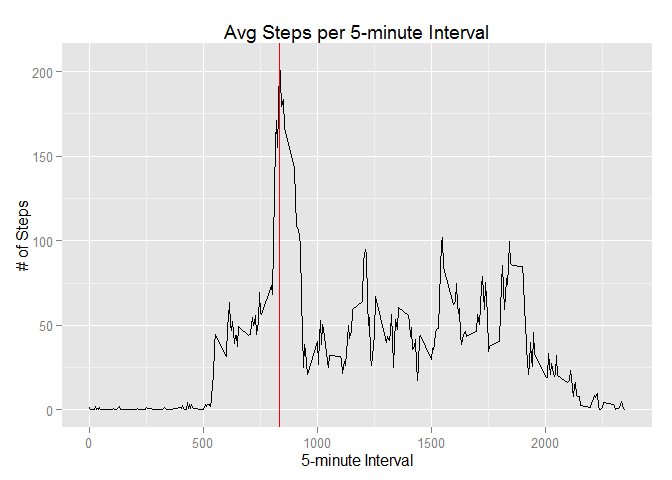
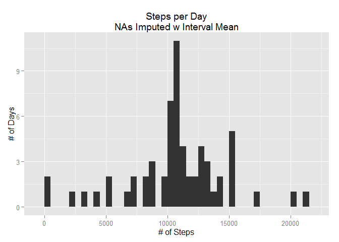
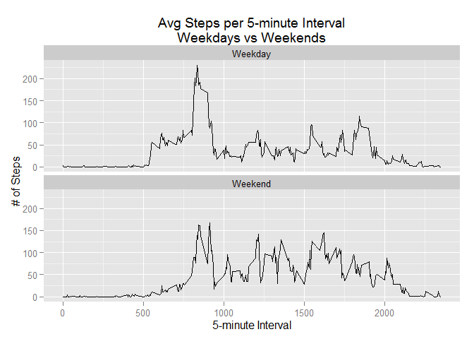

# Reproducible Research: Peer Assessment 1


## Loading and preprocessing the data  

For this assignment I'm going to use a dataset stored in a file named "activity.csv" in the working directory. It has a header row, is comma-delimited and contains 3 columns of data:  
  
1. Number of steps  
2. Date  
3. Time Interval  
  
I'll read this data into a data.frame called dataSet. I also know that we'll be manipulating a data frame, making some graphs and working with dates, so I've already loaded lubridate, plyr, dplyr and ggplot2.


```r
dataSet <- read.csv("activity.csv", header = T, colClasses = c("integer","Date","integer"))
head(dataSet, 5)
```

```
##   steps       date interval
## 1    NA 2012-10-01        0
## 2    NA 2012-10-01        5
## 3    NA 2012-10-01       10
## 4    NA 2012-10-01       15
## 5    NA 2012-10-01       20
```

## What is mean total number of steps taken per day?  
  
First task is to calculate the mean steps taken per day. First we'll need to summarize the data by day. In order to see the data visually, we'll plot a histogram: 
  

```r
stepsByDay <- dataSet %>%
  group_by(date) %>%
  summarise(steps = sum(steps, na.rm = T))

ggplot(data = stepsByDay, aes(steps)) +
  labs(title = "Steps per Day",
       y = "# of Days",
       x = "# of Steps") +
  geom_histogram(binwidth = 500)
```

 

Besides the large spike of 0's caused by days without readings, the data looks fairly normal in it's distribution. We'll also calculate both the mean and the median, ignoring any NA values in the dataset. 
  

```r
mean(stepsByDay$steps, na.rm = T)
```

```
## [1] 9354.23
```

```r
median(stepsByDay$steps, na.rm = T)
```

```
## [1] 10395
```


## What is the average daily activity pattern?
  
Now that we know what the activity per day looks like it's time to find out what the daily activity pattern looks like. Let's create a new summarized dataset by day.


```r
dailyActivity <- dataSet %>%
  group_by(interval) %>%
  summarise(avgSteps = mean(steps, na.rm = T))
```

Since it's important to know the interval, on average, with the most steps, we'll calculate that, too.


```r
maxInterval <- with(dailyActivity, 
                    dailyActivity[avgSteps == max(avgSteps, na.rm = T), ]$interval)
print(maxInterval)
```

```
## [1] 835
```

With this dataset, we can now plot the steps per interval, averaged across all days, with a red line at the maximum interval.


```r
ggplot(data = dailyActivity) +
  geom_line(aes(x = interval, y = avgSteps)) +
  labs(title = "Avg Steps per 5-minute Interval",
       x = "5-minute Interval",
       y = "# of Steps") +
  geom_vline(xintercept = maxInterval, color = "red")
```

 

## Imputing missing values  
  
This dataset has a large number of missing values. Let's find out how many there are and what percentage they are of the total rows:  


```r
nrow(dataSet)
```

```
## [1] 17568
```

```r
sum(is.na(dataSet$steps))
```

```
## [1] 2304
```

```r
round(sum(is.na(dataSet$steps))/nrow(dataSet),2)
```

```
## [1] 0.13
```
  
That's a significant number of NA's, so let's see what the data looks like if we clean it up a bit. We'll create a new dataset and fill in the NA values with the corresponding interval's average steps for all days. 
  

```r
filledDataset <- dataSet %>%
  mutate(fullSteps = ifelse(is.na(steps),
                            dailyActivity[dailyActivity$interval == interval]$avgSteps,
                            steps))

sum(is.na(filledDataset$fullSteps))
```

```
## [1] 0
```
  
Problem solved. We now have a new variable with no NA values. How does this compare to the original dataset? Let's find out.


```r
stepsByDay <- filledDataset %>%
  group_by(date) %>%
  summarise(steps = sum(steps, na.rm = T),
            fullSteps = sum(fullSteps))

ggplot(data = stepsByDay, aes(fullSteps)) +
  labs(title = "Steps per Day\nNAs Imputed w Interval Mean",
       y = "# of Days",
       x = "# of Steps") +
  geom_histogram(binwidth = 500)
```

 

Our data has cleaned up nicely and is much more normally distributed that before. The large spike of 0-step days has been shifted to the middle of the histogram


```r
fullVsNA <- stepsByDay %>%
  summarise(avgStepsNAs = mean(steps, na.rm = T),
            medianStepsNAs = median(steps, na.rm = T),
            avgStepsFull = mean(fullSteps),
            medianStepsFull = median(fullSteps))

print(fullVsNA)
```

```
## Source: local data frame [1 x 4]
## 
##   avgStepsNAs medianStepsNAs avgStepsFull medianStepsFull
## 1     9354.23          10395     10766.19        10766.19
```

```r
with(fullVsNA, print(round((avgStepsFull - avgStepsNAs)/avgStepsNAs, 2)))
```

```
## [1] 0.15
```

```r
with(fullVsNA, print(round((medianStepsFull - medianStepsNAs)/medianStepsNAs, 2)))
```

```
## [1] 0.04
```
  
This data shows us that our method of imputing NA based on interval means increased the average steps per day by 15% but the median by only 4%. It also brought the average steps much closer to the median, meaning the data is now more normally distributed, as was shown in the histogram.


## Are there differences in activity patterns between weekdays and weekends?

In order for us to be able to tell if there's a difference in activity between the weekdays and the weekends we'll need to be able to tell which is which for each date.


```r
filledDataset <- filledDataset %>%
  mutate(dayOfWeek = wday(date, label = T),
         dayType = as.factor(ifelse(dayOfWeek %in% c("Sun","Sat"), "Weekend", "Weekday")))
```

Now that we have our day classification factor, we can see what the difference in steps looks like. Let's calculate the average steps per interval for weekdays and weekends and plot the results.


```r
wdVsWe <- filledDataset %>%
  group_by(dayType, interval) %>%
  summarise(avgSteps = mean(fullSteps))

ggplot(data = wdVsWe) +
  geom_line(aes(x = interval, y = avgSteps)) +
  labs(title = "Avg Steps per 5-minute Interval\nWeekdays vs Weekends",
       x = "5-minute Interval",
       y = "# of Steps") +
  facet_wrap(~ dayType, ncol = 1, nrow = 2)
```

 

It looks like the primary difference between the datasets is a large spike of activity on Weekday mornings versus sustained activity throughout weekend days.
